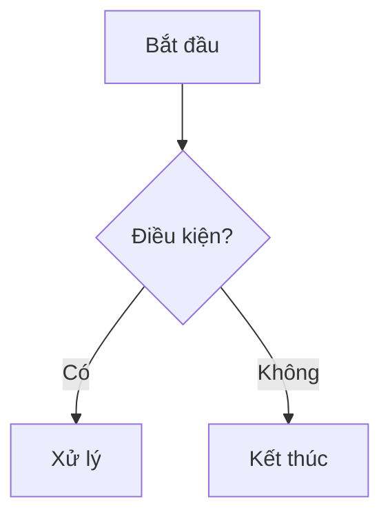

# Report Hub

Trung tâm lưu trữ và trình bày báo cáo Markdown. Mỗi thư mục cấp cao nhất là một
**dự án**; bên trong có thể chứa report trực tiếp hoặc thư mục con (không giới hạn
độ sâu). Report hỗ trợ ảnh, sơ đồ **mermaid** và bố cục ảnh tùy chỉnh.

> 🧭 Dùng **thanh bên trái** để duyệt theo dự án. Cây thư mục tự động trở thành
> sidebar — bạn chỉ cần tạo folder và commit.

---

## Cách viết report (quan trọng)

### Ảnh

| Nhu cầu | Cú pháp |
|---|---|
| Ảnh thường (rộng hết khổ) | `` |
| Ảnh **căn giữa + chỉnh size** | `<div>` bọc markdown image (xem dưới) |
| Nhiều ảnh **cạnh nhau** | `<div class="report-row">` |
| Ảnh từ URL ngoài | `` |

**Căn giữa + resize** — bọc **cú pháp markdown** (không phải thẻ ``) trong
`<div>`, và **để dòng trống bao quanh ảnh**:

```markdown
<div class="report-img" style="max-width:560px">


*Chú thích ảnh (tùy chọn)*

</div>
```

**Nhiều ảnh trên một hàng:**

```markdown
<div class="report-row">


</div>
```

> ⚠️ **Đừng dùng** `` (thẻ HTML thô với đường dẫn tương
> đối) — Docusaurus **không** xử lý đường dẫn ảnh trong thẻ HTML thô nên ảnh sẽ
> vỡ khi deploy. Luôn dùng cú pháp `` để ảnh được bundle đúng.

### Mermaid

Chỉ cần dùng code fence `mermaid` — hỗ trợ flowchart, sequence, gantt, pie, ER,
state, quadrant... (tự đổi màu theo dark/light):

````markdown

````

---

## Các dự án hiện có (mock data để test)

| Dự án | Cấu trúc | Đặc điểm |
|---|---|---|
| `Website Redesign 2026/` | Report trực tiếp trong folder | Ảnh center/resize, ảnh cạnh nhau, flowchart/sequence/state |
| `data-pipeline-migration/` | Chia theo `phase-*/` | Gantt, pie, ảnh SVG |
| `Security Audit/` | Lồng sâu `2026/Q2/<target>/` | ER diagram, deep nesting, cross-link |
| `ai-chatbot-poc/` | Report + `appendix/` | Quadrant chart |
| `multi-agent collaboration docs/` | Report thật (ảnh PNG + URL) | Ảnh PNG bundled, ảnh URL ngoài |

*Số liệu trong report mock là giả lập, chỉ minh họa cấu trúc.*

---

## Xem trước & triển khai

Toàn bộ website nằm trong thư mục `website/`. Xem file `website/SETUP.md` (trong
repo) để biết cách chạy local và deploy lên GitHub Pages.
