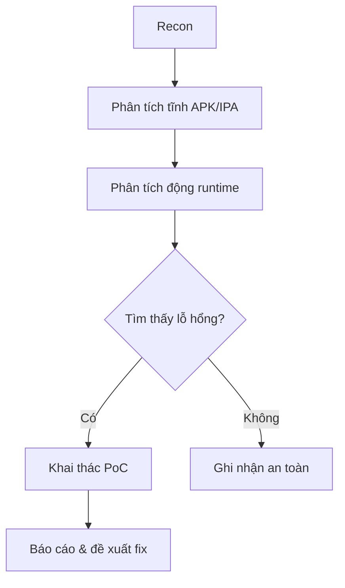

# Pentest Report — Mobile App (Q2/2026)

**Đối tượng:** Ứng dụng di động iOS/Android
**Ngày kiểm thử:** 15/05/2026
**Mức độ rủi ro tổng thể:** 🟠 Trung bình - Cao

---

## Bề mặt tấn công

## Quy trình kiểm thử

## Danh sách phát hiện

| ID | Lỗ hổng | Mức độ | Trạng thái |
|---|---|---|---|
| M-01 | Lưu token trong SharedPreferences không mã hóa | 🔴 Cao | Cần fix |
| M-02 | Thiếu certificate pinning | 🟠 Trung bình | Cần fix |
| M-03 | Log lộ thông tin nhạy cảm | 🟡 Thấp | Đã fix |

🔍 Chi tiết M-01 (bấm để mở)

Token phiên đăng nhập được lưu dạng plaintext trong `SharedPreferences`. Kẻ tấn công
có quyền root/jailbreak có thể đọc trực tiếp. **Đề xuất:** dùng Android Keystore /
iOS Keychain.

---

*Xem thêm: [Web App](../web-app/pentest-report.md) · [API (Q3)](../../Q3/api/pentest-report.md)*
