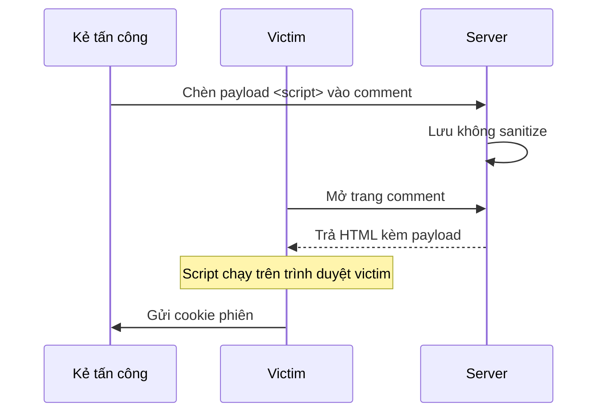

# Pentest Report — Web App (Q2/2026)

**Đối tượng:** Ứng dụng web quản trị nội bộ
**Ngày kiểm thử:** 22/05/2026
**Mức độ rủi ro tổng thể:** 🔴 Cao

---

## Kịch bản khai thác XSS

## Tổng hợp phát hiện

| ID | Lỗ hổng | OWASP | Mức độ |
|---|---|---|---|
| W-01 | Stored XSS ở module comment | A03:2021 | 🔴 Cao |
| W-02 | IDOR truy cập hồ sơ người khác | A01:2021 | 🔴 Cao |
| W-03 | Thiếu header CSP | A05:2021 | 🟠 TB |

> ⚠️ **Khuyến nghị khẩn:** Vá W-01 và W-02 trước khi phát hành. Cả hai đều có thể
> khai thác từ xa không cần xác thực đặc quyền.
