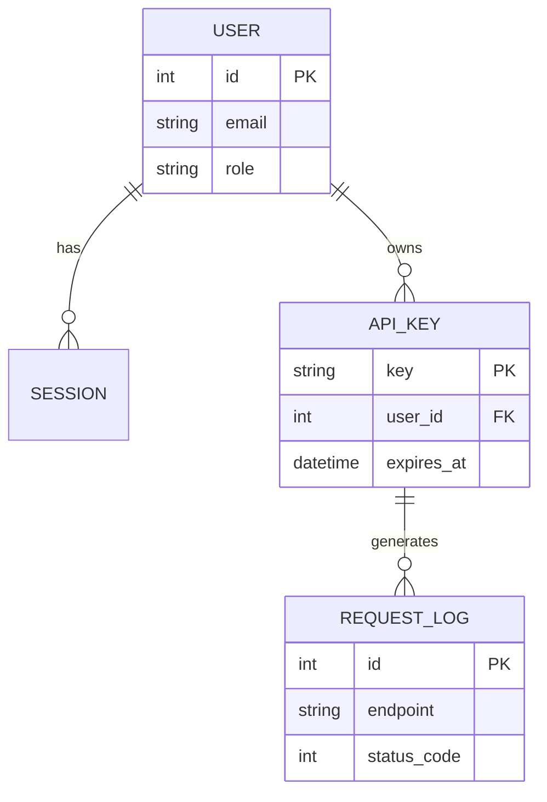

# Pentest Report — API Backend (Q3/2026)

**Đối tượng:** REST API v2
**Ngày kiểm thử:** 10/07/2026
**Mức độ rủi ro tổng thể:** 🟢 Thấp

---

## Mô hình dữ liệu được kiểm tra

Kiểm tra khả năng render **mermaid ER diagram** (sơ đồ quan hệ thực thể):

## Kết quả

| ID | Kiểm tra | Kết quả |
|---|---|---|
| A-01 | Rate limiting | ✅ Đạt |
| A-02 | Xác thực JWT | ✅ Đạt |
| A-03 | Mass assignment | ✅ Đạt |
| A-04 | Verbose error leak | 🟡 Nhẹ |

> ✅ **Kết luận:** API v2 có tư thế bảo mật tốt sau các đợt vá trước. Chỉ còn 1 phát
> hiện mức thấp về thông báo lỗi chi tiết.
