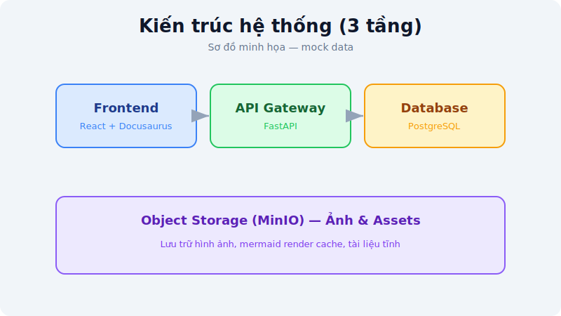
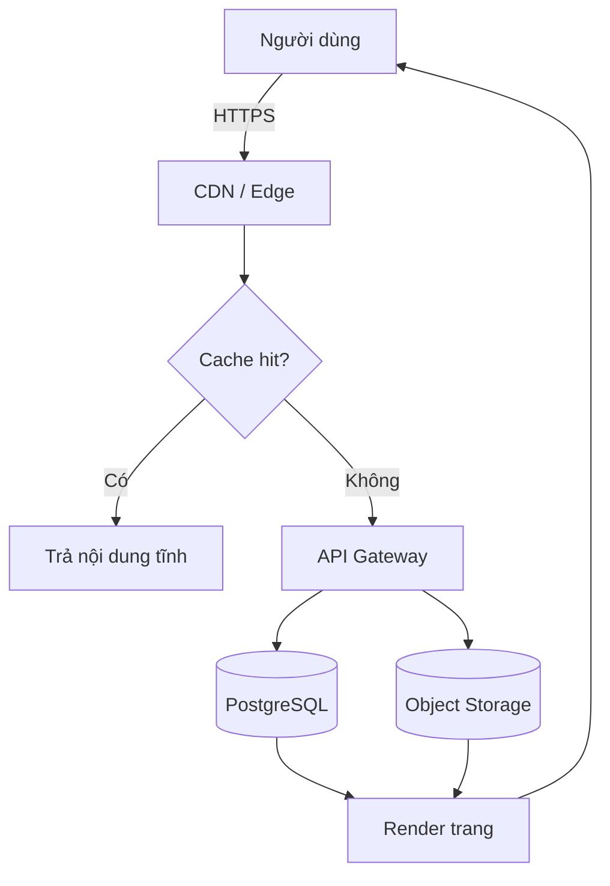
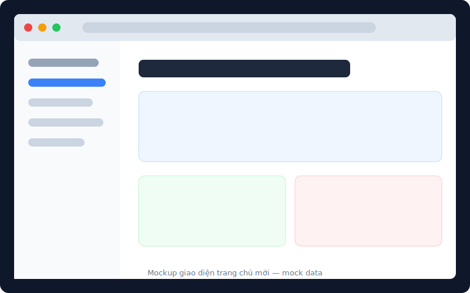

# Website Redesign 2026 — Báo Cáo Tổng Quan

**Ngày báo cáo:** 05/07/2026
**Người nhận:** Ban Lãnh Đạo & Team Product
**Trạng thái:** 🟢 Đang triển khai

---

## Tóm tắt điều hành

Dự án tái thiết kế website công ty nhằm cải thiện tốc độ tải trang, chuẩn hóa
thương hiệu và bổ sung khu vực tài liệu/blog. Báo cáo này tổng hợp bối cảnh,
kiến trúc đề xuất và lộ trình.

> **Điểm nhấn:** Giảm thời gian tải trang chủ từ 4.2s xuống mục tiêu **dưới 1.5s**,
> đồng thời hợp nhất 3 website rời rạc thành một nền tảng duy nhất.

---

## Kiến trúc đề xuất

Ảnh dưới được **căn giữa và thu nhỏ còn 560px** bằng HTML tùy chỉnh (đúng nhu cầu
custom ảnh của bạn):

*Hình 1 — Kiến trúc 3 tầng: Frontend → API Gateway → Database*

Luồng xử lý một request được mô tả bằng **mermaid flowchart**:

---

## Giao diện mới

Ảnh mockup dưới đây để **full-width bằng cú pháp markdown thường** (để so sánh với
ảnh căn giữa ở trên):

---

## Lộ trình

| Giai đoạn | Nội dung | Thời gian | Trạng thái |
|---|---|---|---|
| 1 | Nghiên cứu & wireframe | T6/2026 | ✅ Xong |
| 2 | Thiết kế UI & design system | T7/2026 | 🟢 Đang làm |
| 3 | Phát triển frontend | T8/2026 | ⏳ Chờ |
| 4 | Kiểm thử & go-live | T9/2026 | ⏳ Chờ |

📎 Ghi chú kỹ thuật bổ sung (bấm để mở)

- Sử dụng **Docusaurus** cho khu vực docs/blog.
- Ảnh lưu tại object storage, tối ưu bằng WebP.
- Mọi sơ đồ dùng mermaid để dễ bảo trì (không phải ảnh tĩnh).

---

*Xem chi tiết kỹ thuật tại [Technical Spec](./technical-spec.md).*
