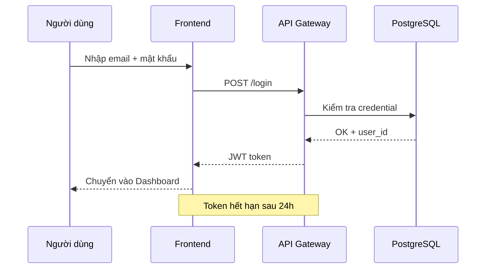
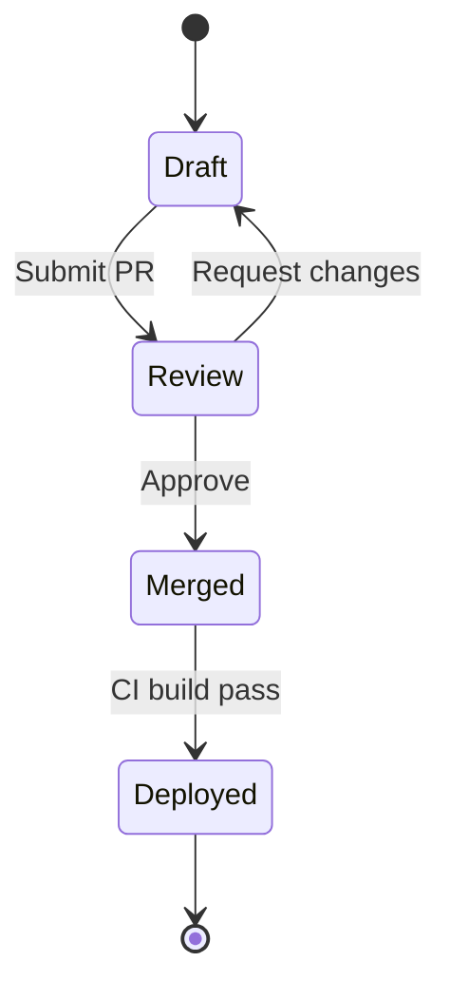

# Website Redesign 2026 — Đặc Tả Kỹ Thuật

**Ngày:** 06/07/2026
**Người soạn:** Team Engineering

---

## Luồng xác thực người dùng

Mô tả bằng **mermaid sequence diagram** — kiểm tra khả năng render sơ đồ tuần tự:

---

## Ngăn xếp công nghệ

| Lớp | Công nghệ | Lý do |
|---|---|---|
| Frontend | React 19 + Docusaurus | SSG nhanh, SEO tốt |
| API | FastAPI (Python) | Async, dễ tích hợp |
| DB | PostgreSQL 16 | Ổn định, JSONB |
| Storage | MinIO (S3-compatible) | Lưu ảnh & assets |
| CI/CD | GitHub Actions → Pages | Tự động deploy |

---

## Kích thước ảnh chuẩn hóa

Để đảm bảo bố cục nhất quán, ảnh chèn trong report tuân theo quy ước:

> Hai ảnh trên đặt **cạnh nhau**, mỗi ảnh chiếm ~48% chiều rộng — minh họa bố cục
> nhiều ảnh trên một hàng.

---

## Sơ đồ trạng thái triển khai

