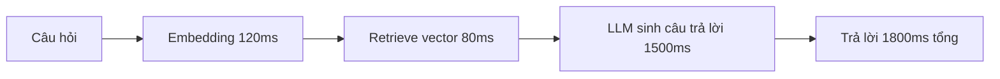

# Phụ Lục — Chi Tiết Benchmark

**Tài liệu bổ trợ cho:** [Báo cáo khả thi AI Chatbot](../feasibility-report.md)

---

## Phương pháp đo

Chạy 500 câu hỏi thực tế từ log CSKH, đo độ chính xác (con người chấm) và độ trễ.

## Kết quả chi tiết

| Mô hình | Độ chính xác | Độ trễ trung bình | Chi phí/1000 câu |
|---|---|---|---|
| RAG + GPT-class | 91% | 1.8s | $2.1 |
| RAG + open-source | 84% | 2.4s | $0.4 |
| Fine-tune 7B | 88% | 1.1s | $0.9 |
| Rule-based | 52% | 0.1s | ~$0 |

## Phân rã độ trễ (RAG + API)

## Ghi chú

- Số liệu là **mock data** phục vụ minh họa cấu trúc report nhiều tầng.
- Ảnh, bảng và sơ đồ đều nằm cùng cây thư mục với file markdown.
