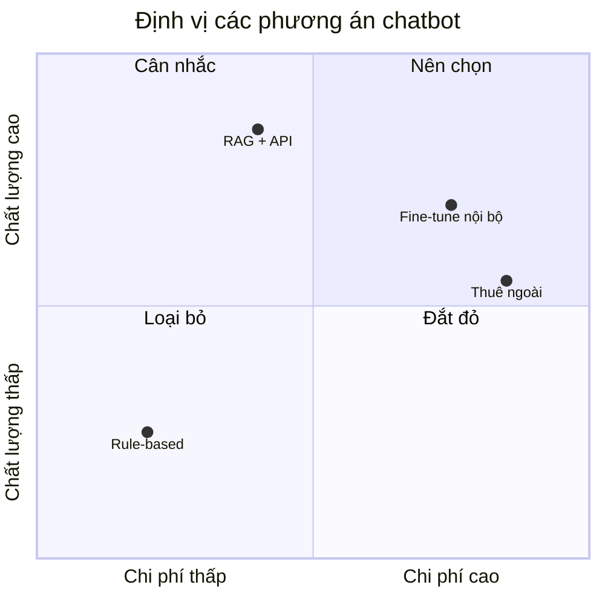

# AI Chatbot POC — Báo Cáo Khả Thi

**Ngày:** 08/07/2026
**Người nhận:** Ban Lãnh Đạo
**Kết luận nhanh:** 🟢 Khả thi, đề xuất triển khai thí điểm

---

## Bối cảnh

Đánh giá tính khả thi của chatbot hỗ trợ khách hàng dựa trên LLM, thay thế 60% câu
hỏi lặp lại cho team CSKH.

## Định vị phương án

Đánh giá 4 phương án theo trục **Chi phí** và **Chất lượng** (mermaid quadrant):

## Hiệu năng dự kiến

## Bảng đánh giá

| Tiêu chí | RAG + API | Fine-tune | Rule-based |
|---|---|---|---|
| Độ chính xác | Cao | Cao | Thấp |
| Chi phí khởi tạo | Trung bình | Cao | Thấp |
| Thời gian triển khai | 3 tuần | 8 tuần | 2 tuần |
| Bảo trì | Dễ | Khó | Dễ |

> ✅ **Đề xuất:** Chọn phương án **RAG + API** — cân bằng tốt giữa chất lượng và chi
> phí. Chi tiết benchmark xem tại [Phụ lục](./appendix/benchmark-details.md).
