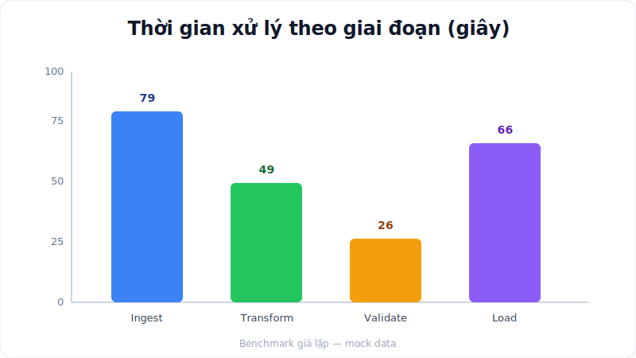
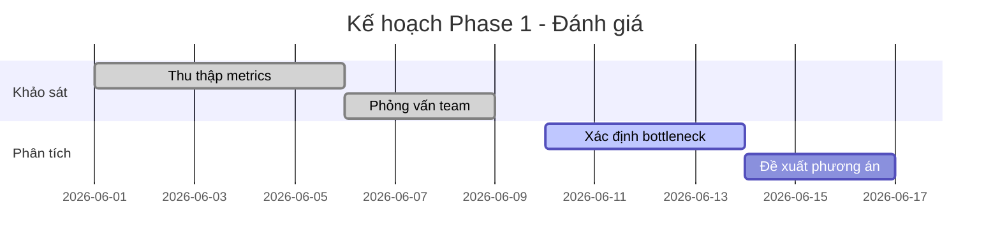
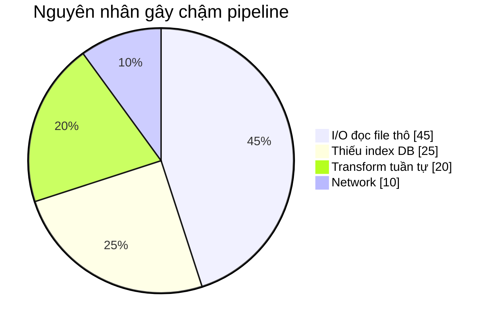

# Data Pipeline Migration — Phase 1: Đánh Giá Hiện Trạng

**Ngày:** 20/06/2026
**Phạm vi:** Khảo sát pipeline ETL hiện tại trước khi di trú lên nền tảng mới

---

## Mục tiêu Phase 1

Đánh giá pipeline hiện tại, đo hiệu năng từng bước và xác định điểm nghẽn (bottleneck).

## Kết quả benchmark

*Hình 1 — Bước **Ingest (79s)** là điểm nghẽn lớn nhất*

## Timeline khảo sát

## Phân bố nguyên nhân chậm

---

## Kết luận

Pipeline hiện tại xử lý tuần tự, chưa song song hóa bước Ingest. Đề xuất chuyển sang
kiến trúc message-queue ở **[Phase 2](../phase-2-execution/report.md)**.
