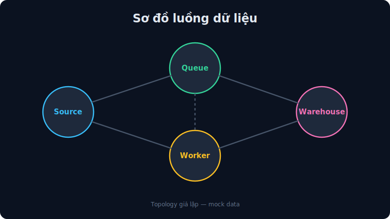
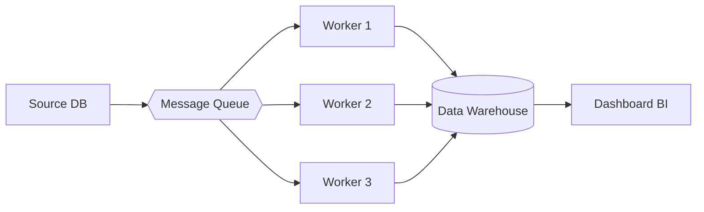
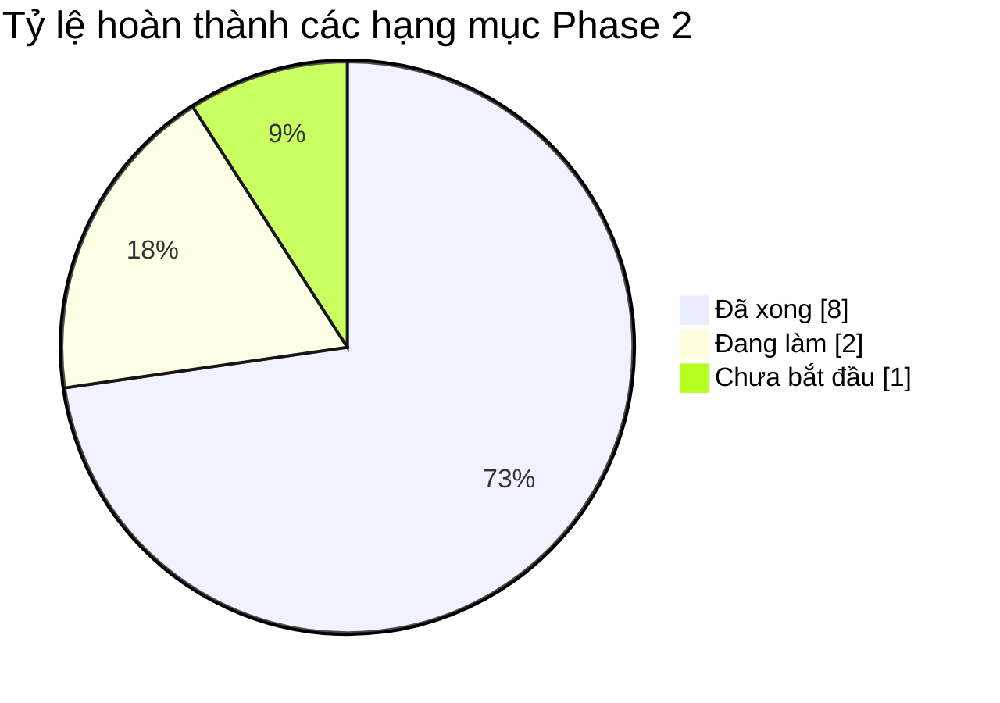

# Data Pipeline Migration — Phase 2: Triển Khai

**Ngày:** 04/07/2026
**Phạm vi:** Chuyển pipeline sang kiến trúc message-queue song song

---

## Kiến trúc mới

Luồng dữ liệu tổng quát (**mermaid flowchart LR** — chiều ngang):

## So sánh trước/sau

| Chỉ số | Trước (Phase 1) | Sau (Phase 2) | Cải thiện |
|---|---|---|---|
| Tổng thời gian | 220s | 74s | **-66%** |
| Bước Ingest | 79s | 21s | -73% |
| Số worker song song | 1 | 3 | ×3 |
| Khả năng retry | Không | Có | ✅ |

## Kết quả đạt được

> ✅ **Kết luận:** Kiến trúc mới đạt mục tiêu giảm 66% thời gian xử lý. Đề xuất
> nghiệm thu và chuyển sang giai đoạn giám sát vận hành.
