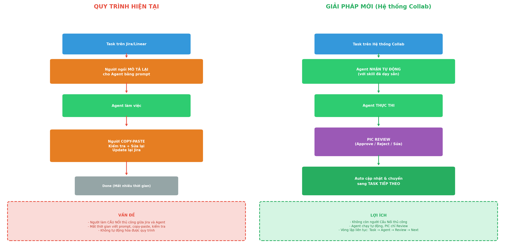
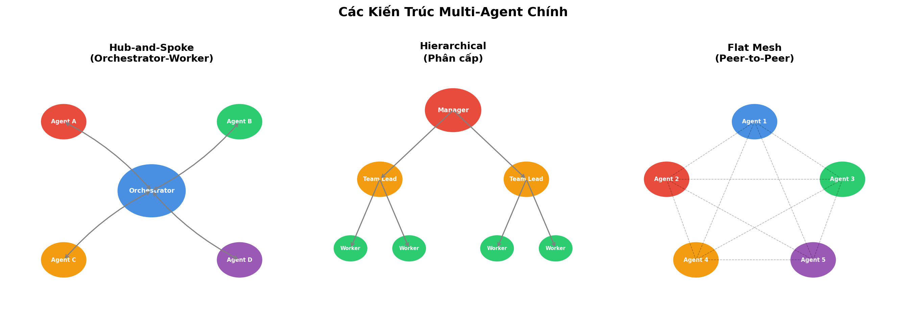
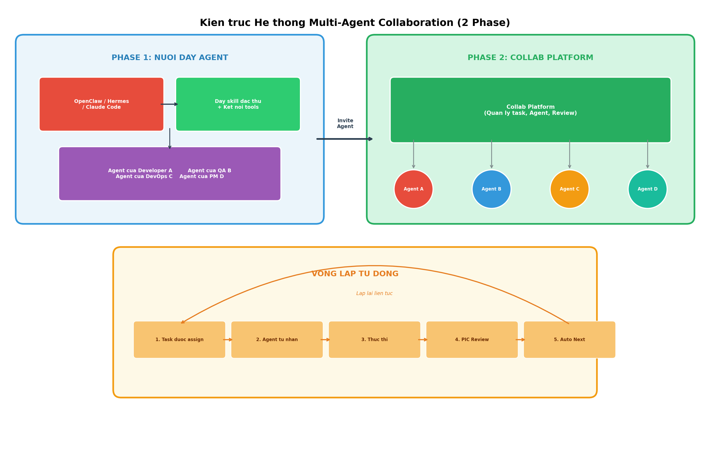

# Báo Cáo Kiểm Tra Tính Khả Thi: Multi-Agent Collaboration Platform

**Ngày báo cáo:** 18/06/2026  
**NgườI nhận:** Ban Lãnh Đạo  
**Mục đích:** Đánh giá tính khả thI của dự án xây dựng nền tảng quản lý Agent tập trung, cho phép các Agent của từng team tự động nhận task, thực thI và chờ PIC review

---

## Tóm Tắt Bài Toán

**Thực trạng đau điểm:** MỗI ngườI trong team hiện có assistant agent riêng (Claude Code, OpenClaw, Hermes, v.v.). Khi nhận task từ Jira/Linear, họ phảI tự ngồI mô tả lạI cho agent bằng prompt, agent làm xong thì họ lạI phảI tự copy-paste, kiểm tra, sửa lạI và update lạI Jira. NgườI làm vai trò "cầu nốI" thủ công, mất thờI gian, không tự động hóa được.

**Giải pháp đề xuất:** Xây dựng hệ thống 2 phase:
- **Phase 1 Nuôi Dạy:** MỗI ngườI dùng OpenClaw/Hermes/Claude Code để dạy skill, kết nốI tools
- **Phase 2 Collab:** Platform trung tâm cho phép invite agent đã dạy vào, agent tự động nhận task → thực thI → PIC review → auto chuyển task tiếp theo

---

## 1. Thực Trạng AI Agent và Khả Năng Hiện Nay

### 1.1. AI Agent đã làm được những gì?

Agent ngày nay không còn là chatbot trả lờI câu hỏI đơn thuần. Các assistant agent hiện đạI có khả năng:

- **Tự động điều khiển trình duyệt:** Click, nhập liệu, cuộn trang, điền form như ngườI thật
- **Viết và chạy code:** Trong môi trường sandbox an toàn, tự debug
- **Tự lập lịch làm việc:** Cron jobs, heartbeat, chạy 24/7 trên VPS
- **Giao tiếp đa kênh:** Telegram, Slack, WhatsApp, Discord, iMessage
- **Ghi nhớ ngữ cảnh:** Memory dạng file, nhớ cách làm việc của từng ngườI
- **Tự tạo skill mớI:** Từ kinh nghiệm thực thI, không cần ngườI viết thêm

### 1.2. Các Agent Nổi Bật

#### OpenClaw (SkyworkAI)

OpenClaw là agent tự host, chạy persistent 24/7 trên máy chủ riêng. Điểm nổI bật:

- **Browser automation:** Điều khiển Chrome thật qua CDP protocol, nhìn thấy giao diện, click đúng vị trí
- **Gateway architecture:** Quản lý 20+ kênh messaging (Telegram, Slack, Discord, WhatsApp, iMessage)
- **Memory dạng file:** SOUL.md, MEMORY.md, AGENTS.md giữ ngữ cảnh xuyên suốt qua các phiên
- **ClawHub marketplace:** 1000+ skill mở rộng, cộng đồng đóng góp
- **MCP integration:** Kết nốI 134+ tools qua Model Context Protocol

OpenClaw phù hợp cho team muốn kiểm soát hoàn toàn agent của mình, không phụ thuộc vào dịch vụ cloud.

#### Hermes Agent (Nous Research)

Hermes đạt 60.000+ sao GitHub chỉ trong 2 tháng, cho thấy sức hút mạnh mẽ. Điểm độc đáo:

- **Self-improving loop:** Tự tạo skill mớI từ kinh nghiệm thực thI, agent "học" từ lần làm trước
- **Multi-layer memory:** Semantic memory, working memory, episodic memory hoạt động cùng nhau
- **Cloud-native:** Thiết kế cho chạy 24/7 trên VPS chỉ $5/tháng
- **Sub-agent spawning:** Tạo agent con cho từng task nhỏ, phân rã công việc tự động

Hermes phù hợp cho ngườI muốn agent tự học và cải thiện theo thờI gian mà không cần can thiệp thường xuyên.

#### Claude Code (Anthropic)

Claude Code là coding agent trực tiếp từ Anthropic, tích hợp sâu với terminal:

- **Deep codebase context:** Đọc và hiểu toàn bộ codebase, không chỉ từng file riêng lẻ
- **Terminal-native:** Chạy trực tiếp trong terminal, thực thI lệnh như developer thật
- **Tool use:** Truy cập GitHub, tạo PR, chạy test, sửa lỗi tự động
- **Vision capability:** Đọc screenshot, hiểu giao diện đồ họa

Claude Code phù hợp cho developer, tập trung vào coding task.

#### Claude Computer Use (Anthropic)

Computer Use là tính năng điều khiển desktop ảo của Claude:

- **Điều khiển desktop ảo:** Qua vision + mouse/keyboard actions
- **Nhận screenshot:** Phân tích giao diện, ra quyết định click hay type
- **Chạy trong Docker container:** An toàn, có thể quan sát và dừng bất cứ lúc nào
- **SWE-bench Verified:** Đạt 49%, vượt mặt các model chuyên coding

Computer Use phù hợp cho task cần tương tác với giao diện đồ họa, không chỉ command line.

### 1.3. So Sánh Các Agent

| Agent | Điểm mạnh nhất | Chạy 24/7 | Tự học | Browser Control | Phù hợp cho |
|-------|---------------|-----------|--------|----------------|-------------|
| **OpenClaw** | Multi-channel, Skills hub | Có | Ít | Có (CDP) | Team cần kiểm soát hoàn toàn |
| **Hermes** | Self-improvement, Memory | Có | **Có** | Có | NgườI muốn agent tự học |
| **Claude Code** | Deep codebase, Terminal | Không | Không | Không | Developer |
| **Claude Computer Use** | Vision-based control | Không | Không | **Desktop ảo** | Task cần GUI |

---

## 2. Xu Hướng Multi-Agent và Các Nền Tảng

### 2.1. Tại sao cần Multi-Agent?

Một agent đơn lẻ dù giỏI đến đâu cũng không thể làm tất cả. Multi-Agent System (MAS) cho phép:

- **Chuyên môI hóa:** MỗI agent giỏI một việc, làm tốt hơn agent đa năng
- **Song song hóa:** Nhiều agent làm cùng lúc, rút ngắn thờI gian
- **Human-in-the-loop:** PIC review ở giữa pipeline, đảm bảo chất lượng
- **Mở rộng:** Thêm agent mớI dễ dàng, không ảnh hưởng hệ thống cũ

### 2.2. Các Kiến Trúc Multi-Agent Chính

**Hub-and-Spoke (Phổ biến nhất)**
Một agent điều phối ở trung tâm, phân rã task cho các worker agent. Các worker không giao tiếp trực tiếp với nhau. Dễ debug, kiểm soát tập trung, phù hợp cho customer support và code generation.

**Hierarchical (Phân cấp)**
Cấu trúc cây: Manager -> Team Lead -> Worker. Xử lý workflow doanh nghiệp đa miền (pháp lý, tài chính, kỹ thuật). Phù hợp cho enterprise workflows phức tạp.

**Flat Mesh (Peer-to-Peer)**
Agent giao tiếp trực tiếp, không cần điều phối viên. Linh hoạt cao nhưng khó debug. Phù hợp cho open-ended exploration.

### 2.3. Các Giao Thức Chuẩn

**MCP (Model Context Protocol)** - Anthropic
- Chuẩn kết nốI agent với tools bên ngoàI (Jira, GitHub, Slack, database)
- Đã có 1000+ MCP servers mở rộng
- Agent dùng MCP để "cắm" vào các hệ thống sẵn có

**A2A (Agent-to-Agent Protocol)** - Google
- Chuẩn giao tiếp giữa các agent với nhau
- Agent khám phá lẫn nhau qua Agent Card
- Hỗ trợ 50+ enterprise platforms

### 2.4. Các Nền Tảng Collab Đã Có Trên Thị Trường

| Nền tảng | Mô tả | Gần giống dự án mức nào | Giá | Hạn chế |
|----------|-------|------------------------|-----|---------|
| **AgentCenter** | Task -> agent queue -> review workflow | Rất gần | $14/tháng (5 agents) | MớI ra, chưa phổ biến |
| **Notion 3.0 Agents** | Agent tự động làm task 20 phút, kết nốI Slack/GitHub | Trung bình | Business plan | Không phảI project management |
| **Devin Teams** | Nhận ticket Linear -> tự code -> tạo PR | Thấp | $80/tháng | Chỉ cho coding |
| **Tembo** | Orchestration nhiều agents, trigger từ Linear/Slack | Thấp | $60/tháng | Chỉ cho coding |
| **Definable.ai** | Kết nốI Linear vớI AI agents | Thấp | Tùy gói | Agent đơn giản |
| **Monday.com AI** | AI assistant trong task management | Thấp | $16/tháng | Không có autonomous agent |

**Nhận xét:** AgentCenter là nền tảng gần nhất vớI ý tưởng, nhưng chưa có tính năng "invite agent cá nhân đã dạy". Các nền tảng khác hoặc quá hẹp (chỉ coding) hoặc chưa đủ tự động.

---

## 3. Kiểm Tra Tính Khả ThI Dự Án

### 3.1. Phân Tích Bài Toán

Dự án gồm 2 phase:

**Phase 1 - Nuôi Dạy:**
- MỗI ngườI chọn agent phù hợp (OpenClaw, Hermes, Claude Code)
- Dạy skill đặc thù cho role của họ (coding, testing, writing, analysis)
- Kết nốI agent vớI các tools thường dùng (Jira API, GitHub, Slack, API nộI bộ)
- Agent trở thành "nhân viên ảo" chuyên biệt của từng ngườI

**Phase 2 - Collaboration Platform:**
- Xây dựng hệ thống quản lý task tập trung
- NgườI dùng invite/connect agent đã dạy vào project
- Vòng lặp tự động: Task assign → Agent nhận → Thực thI → PIC Review → Approve → Auto next task
- PIC chỉ việc review output, không còn làm cầu nốI thủ công

### 3.2. Đánh Giá Tính Khả ThI Phase 1: Nuôi Dạy Agent

| Tiêu chí | Đánh giá | Ghi chú |
|----------|---------|---------|
| **Công nghệ** | **Cao** | OpenClaw, Hermes, Claude Code đều đã production-ready |
| **ThờI gian** | **2-4 tuần** | Có agent cơ bản chạy được |
| **Chi phí** | **Thấp** | VPS $5-20/tháng, API cost $50-200/tháng |
| **Rủi ro** | **Thấp** | Làm độc lập, không ảnh hưởng hệ thống khác |
| **Kỹ năng cần có** | Scripting, API integration | Không cần ML/AI chuyên sâu |

**Kết luận Phase 1: Khả thI cao.** Đây là việc cấu hình và tích hợp công cụ sẵn có, không cần phát triển phần mềm mớI. MỗI ngườI có thể tự làm cho agent của mình.

### 3.3. Đánh Giá Tính Khả ThI Phase 2: Collab Platform

| Tiêu chí | Đánh giá | Ghi chú |
|----------|---------|---------|
| **Công nghệ** | **Trung bình - Cao** | Cần xây platform kết nốI agent qua MCP/A2A |
| **ThờI gian** | **2-3 tháng** | Cho MVP cơ bản |
| **Chi phí** | **Trung bình** | 2 developers, hosting, API costs |
| **Rủi ro** | **Trung bình** | Phụ thuộc vào Phase 1, cần test kỹ |
| **Kỹ năng cần có** | Backend, API design, real-time systems | Cần team dev có kinh nghiệm |

**Thách thức chính:**
- **Kết nốI agent đa dạng:** MỗI agent (OpenClaw, Hermes, Claude) có cách giao tiếp khác nhau → cần abstraction layer
- **Real-time communication:** Agent cần nhận task và báo cáo tiến độ real-time → cần WebSocket/SSE
- **State management:** Theo dõI trạng tháI task, agent đang làm gì, lỗI xảy ra ở đâu
- **Security:** Agent có quyền truy cập tools, cần RBAC và audit log đầy đủ

**Giải pháp cho các thách thức:**
- Dùng MCP protocol làm abstraction layer, mỗI agent cung cấp MCP server
- Dùng LangGraph hoặc CrewAI làm orchestration engine
- Dùng Redis/Postgres cho state management và queue
- Dùng LangSmith hoặc tương đương cho observability

**Kết luận Phase 2: Khả thI trung bình - cao.** Công nghệ đã sẵn sàng nhưng cần engineering effort đáng kể. Không có nền tảng nào làm đúng yêu cầu "invite agent cá nhân" nên cần tự phát triển hoặc tùy biến mạnh.

### 3.4. So Sánh VớI Đối Thủ

**AgentCenter** là đối thủ gần nhất, nhưng khác biệt ở:
- AgentCenter cung cấp agent sẵn, dự án này cho phép dùng agent cá nhân đã dạy
- AgentCenter là SaaS, dự án này có thể self-hosted
- AgentCenter mớI ra Q1/2026, thị trường còn mở rộng

**LợI thế cạnh tranh của dự án:**
- Agent đã được "nuôi dạy" theo cách làm việc của từng team → phù hợp hơn agent generic
- PIC quen thuộc vớI agent của mình → dễ tin tưởng và review
- Không bị lock-in vào một vendor → linh hoạt đổI agent

### 3.5. RủI Ro và Giải Pháp

| RủI ro | Mức độ | Giải pháp |
|--------|--------|-----------|
| Agent làm sai | Cao | Human review gate bắt buộc trước khi commit |
| Agent chậm/tốn token | Trung bình | Set timeout, budget limit, queue management |
| Bảo mật dữ liệu | Cao | Audit log đầy đủ, RBAC, không lưu sensitive data |
| Khó tích hợp agent đa dạng | Trung bình | Dùng MCP/A2A protocol chuẩn, abstraction layer |
| NgườI dùng không muốn dùng | Thấp | Bắt đầu tự nguyện, chứng minh tiết kiệm thờI gian |
| Phase 1 chưa xong đã làm Phase 2 | Cao | Hoàn thành Phase 1 trước, có agent chạy tốt mớI làm Phase 2 |

### 3.6. Lộ Trình và Chi Phí Đề Xuất

**Quyết định: NÊN LÀM** - Tính khả thI tổng thể: **CAO**

Lý do:
- Công nghệ đã sẵn sàng (framework production-ready, MCP/A2A chuẩn hóa)
- Chưa ai làm đúng ý tưởng "invite agent cá nhân" → cơ hộI thị trường mở
- ROI rõ ràng: PIC chỉ review, không còn làm cầu nốI thủ công
- Bắt đầu nhỏ, chứng minh giá trị, rồI mở rộng

**Lộ trình 6 tháng:**

| Giai đoạn | ThờI gian | NộI dung | Kết quả kỳ vọng |
|-----------|----------|----------|----------------|
| **Pilot Phase 1** | Tháng 1-2 | Chọn 3-5 ngườI, setup agent, dạy skill cho 1-2 task | Agent chạy được task đơn giản, đo thờI gian trước/sau |
| **Mở rộng Phase 1** | Tháng 3 | Thêm ngườI dùng, thêm skill phức tạp | 10+ ngườI có agent chạy tốt |
| **MVP Phase 2** | Tháng 3-4 | Xây platform: task list, agent connector, review UI | Vòng lặp Task→Agent→Review→Next chạy được |
| **Tích hợp** | Tháng 4-5 | Kết nốI Jira/Linear API, nhiều agent types | Platform chạy end-to-end vớI Jira |
| **Production** | Tháng 5-6 | Mở rộng team, tốI ưu, đo ROI | Toàn bộ team dùng, report ROI |

**Chi phí ước tính 6 tháng:**

| Hạng mục | Chi phí |
|----------|---------|
| VPS chạy agent (10 ngườI) | $100-200/tháng |
| LLM API (OpenAI/Anthropic) | $500-2000/tháng |
| Platform hosting | $100-300/tháng |
| Engineering (2 dev) | Internal |
| **Tổng** | **$700-2500/tháng** |

### 3.7. Khuyến Nghị CuốI Cùng

1. **Bắt đầu ngay Phase 1:** Dễ làm, rủi ro thấp, mỗI ngườI có thể tự setup agent của mình
2. **Chọn OpenClaw hoặc Hermes:** OpenClaw nếu muốn kiểm soát, Hermes nếu muốn agent tự học
3. **Đừng xây Phase 2 quá sớm:** Hoàn thành Phase 1, có agent chạy tốt, rồI mớI đầu tư Phase 2
4. **Theo dõI AgentCenter:** Nếu AgentCenter phát triển nhanh, có thể dùng làm base thay vì tự xây
5. **Đo lường từ đầu:** Ghi lạI thờI gian trước và sau khi dùng agent để chứng minh ROI

---

## Tài Liệu Tham Khảo

1. [OpenClaw GitHub Repository](https://github.com/SkyworkAI/OpenClaw)
2. [Hermes Agent - Nous Research](https://github.com/NousResearch/hermes-agent)
3. [Anthropic Claude Computer Use](https://www.anthropic.com/news/developing-computer-use)
4. [AgentCenter - Agent Task Management](https://www.agentcenter.cloud)
5. [Notion 3.0 AI Agents](https://www.notion.com/releases/2025-09-18)
6. [Devin AI Teams](https://www.devin.ai)
7. [Model Context Protocol - Anthropic](https://modelcontextprotocol.io)
8. [A2A Protocol - Google](https://google.github.io/A2A/)
